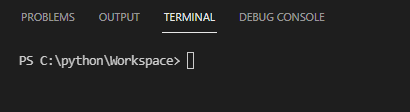
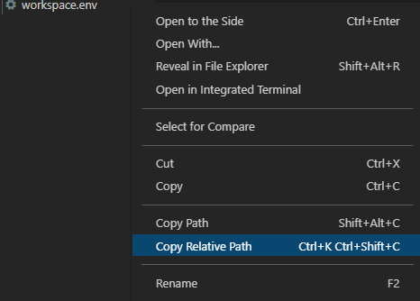
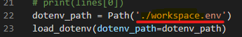
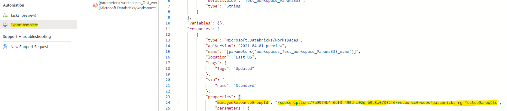

# Validate CRUD operations on Azure Databricks Workspace using Python
## Introduction

This validation involves performing CRUD operations on Azure Databricks Workspace using Python. Some of the pre-requisites for testing this validations:

1. Install python 3.7 or above from [Python code](https://www.python.org/downloads/)
2. Install visual studio code or any preferred IDE
3. Install Python extension for Visual studio code by selecting Python Extension in "Extension" tab
4. Clone the repo or create a folder for storing all the scripts from the repo.
5. Open that folder in Visual studio. If cloned, you should be able to see the all the scripts (createWorkspace.py, updateWorkspace.py, readWorkspace.py, deleteWorkspace.py) with a readme.md, requirements.txt, and workspace.env file. The workspace.env file is where we pass the parameters with our desired inputs and configure Databricks workspace. The requirements.txt file contains all the required python libraries
6. Now run this command 

		pip install -r requirements.txt

7. Once cloned the repo, make sure the terminal is pointing at the right path in the terminal
 
8. Please utilize the workpsace.env file for performing any validation. Please note that all the parameters have to be "string" data type in workspace.env file.
9. Make sure to copy the relative path of workspace.env and make sure to place it as a Path argument of 'dotenv_path' variable on all the python scripts

  

10. Run the command in the terminal for authenticating login into azure

		az login

11. Using a subscription (Azure Databricks RP BugBash 01), create a ResourceGroup manually using Azure portal

### Create a plain vanilla Workspace
1. Files used for this scenario: createWorkspace.py and workspace.env
2. In the workspace.env, specify the parameters of the variables:
	##### a) 'resource_group' - Name of the Resource Group
	##### b) 'WORKSPACE_NAME' - Name of the Databricks Workspace to be created 
	##### c) 'SKU' - SKU tier of the workspace. Expected values for SKU tier are "Premium", "Standard", and "Trial"
	##### d) 'Location' - Location of the workspace
	##### e) 'enable_no_public_ip' - Enable No Public IP (Secure Connectivity cluster) [Optional]. Specify "True" to set NPIP enabled. Default value is "False"
	##### f) 'MRG' - ManagedResourceGroupID of the workspace which is assigned by default once the workspace is created. For this scenario, you may ignore this variable
3. Save the .env file and run the command :	

		Python createWorkspace.py

4. You should be able to see the workspace created in the resource group within the Azure Portal

### Update a Databricks Workspace
1. Files used for this scenario: updateWorkspace.py and workspace.env
2. For an existing workspace, take a note of the 'managedResourceGroupID' from the export template of the databricks workspace page in the azure portal.
   
3. In this scenario, you can perform update on tags and SKU of a workspace but cannot update enableNPIP. Tags can be updated on line 67 in updateWorkspace.py script.
4. In the workspace.env, make sure to provide the parameters:
	##### a) 'resource_group' - Name of the Resource Group
	##### b) 'WORKSPACE_NAME' - Name of the existing Workspace to be updated
	##### c) 'SKU' - SKU tier of the workspace. Expected values for SKU tier are "Premium", "Standard", and "Trial"
	##### d) 'Location' - Location of the workspace
	##### e) 'enable_no_public_ip' - Enable No Public IP (Secure Connectivity cluster)
	##### f) 'MRG' - ManagedResourceGroupID of the workspace. For update, we would need to update the MRG with the managedResourceGroupID copied from the export template
5. Save all and run the command	

		Python updateWorkspace.py

6. Refresh your workspace in the Azure portal. You should be able to see workspace tags and SKU tier to be updated

### Read a Databricks Workspace
1. Files used for this scenario: readWorkspace.py and workspace.env
2. In the Visual studio code, open the workspace.env and specify the parameters of the variables;
	##### a) 'resource_group' - Name of the Resource Group
	##### b) 'WORKSPACE_NAME' - Name of the Databricks Workspace to be read
	##### c) You can update tags on line 63 in ReadWorkspace.py [optional]
3. Rest of the variables are not dependable on the execution, so can be left out
4. Save all and run the command 

		Python ReadWorkspace.py

5. You should be able to see the details of the workspace displayed in the terminal

### Delete a Databricks Workspace
1. Files used for this scenario: deleteWorkspace.py and workspace.env
2. In the Visual studio code, open the workspace.env and specify the parameters of the variables;
	##### a) 'resource_group' - Name of the Resource Group
	##### b) 'WORKSPACE_NAME' - Name of the Databricks Workspace to be deleted (Note: This operation only deletes the Databricks Workspace)
3. Rest of the variables are not dependable on the execution, so can be left out
4. Save all and run the command 

		Python deleteWorkspace.py

5. In Azure portal, navigate to the workspace in the resource group. You should be able to see the workspace status to be in deleting state or deleted